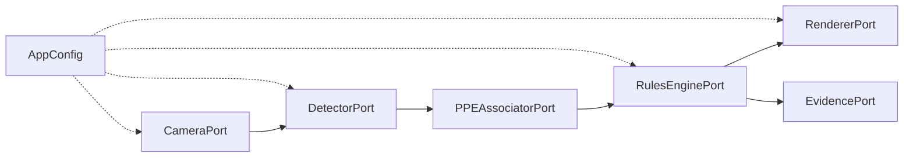

# Arquitetura — PPE Detection

## Visão geral

Sistema de detecção de EPI em tempo real via câmera, baseado em pipeline modular orientado a contratos.

## Camadas

| Camada | Responsabilidade | Módulos |
|--------|------------------|---------|
| **Domain** | Tipos e invariantes puros | `domain/models.py`, `domain/geometry.py` |
| **Contracts** | Interfaces (ports) | `contracts/ports.py` |
| **Adapters** | Integrações externas | `camera/`, `detection/`, `visualization/` |
| **Application** | Orquestração | `pipeline.py`, `main.py` |
| **Config** | Carregamento YAML | `config.py` |

## Pipeline por frame

1. `CameraPort.read()` — obtém `Frame` (numpy array BGR).
2. `DetectorPort.detect(frame)` — retorna `FrameDetections` (persons, ppe_items, violations).
3. `PPEAssociatorPort.associate(person, items, type)` — vincula EPI à pessoa por região anatômica.
4. `RulesEnginePort.evaluate(detections)` — retorna `list[PersonCompliance]` com alertas confirmados.
5. `RendererPort.render(frame, detections, compliance)` — frame anotado para exibição.
6. `EvidencePort.save(frame, compliance)` — persiste evidência se alerta confirmado.

## Modelo de IA

- **Engine**: Ultralytics YOLO (adapter em `detection/detector.py`).
- **Modelo padrão**: `Hexmon/vyra-yolo-ppe-detection` — detecta Person, EPIs e classes de violação (NO-Hardhat, etc.).
- **Tracking**: ByteTrack via Ultralytics (`tracking.enabled`).

## Extensibilidade (épicos futuros)

| Épico | Extensão prevista |
|-------|-------------------|
| 6 — Alertas | `notifications/` adapter (Telegram, e-mail) |
| 7 — Dashboard | API REST + frontend separado |
| 8 — Admin | CRUD câmeras, upload de modelos |

Cada extensão exige nova spec + contrato antes da implementação.
